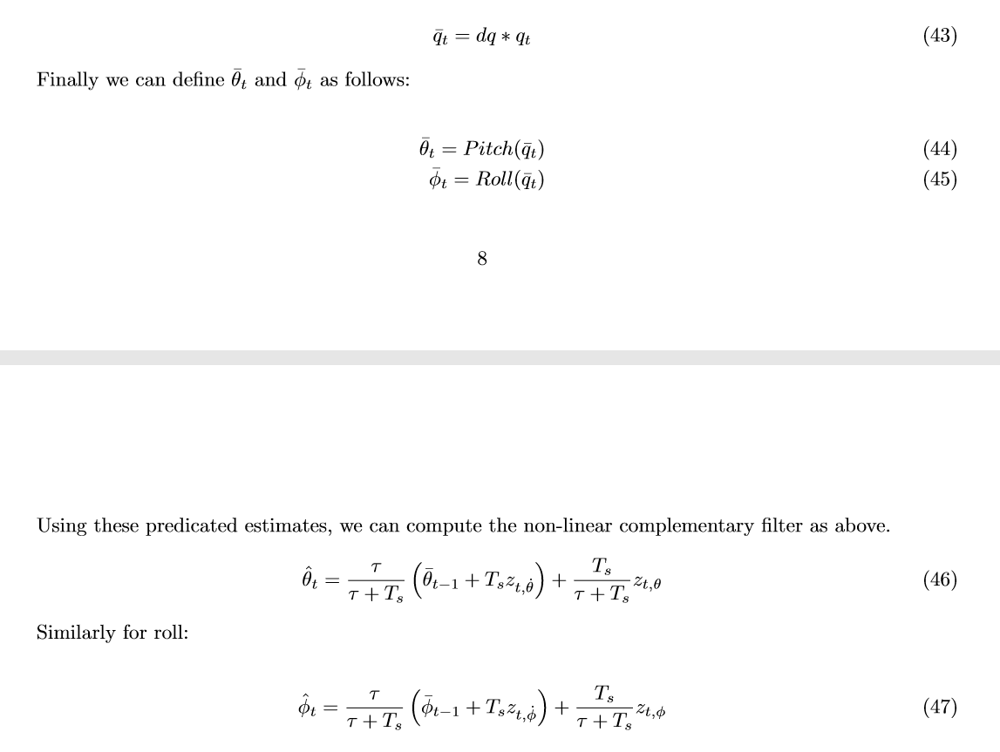
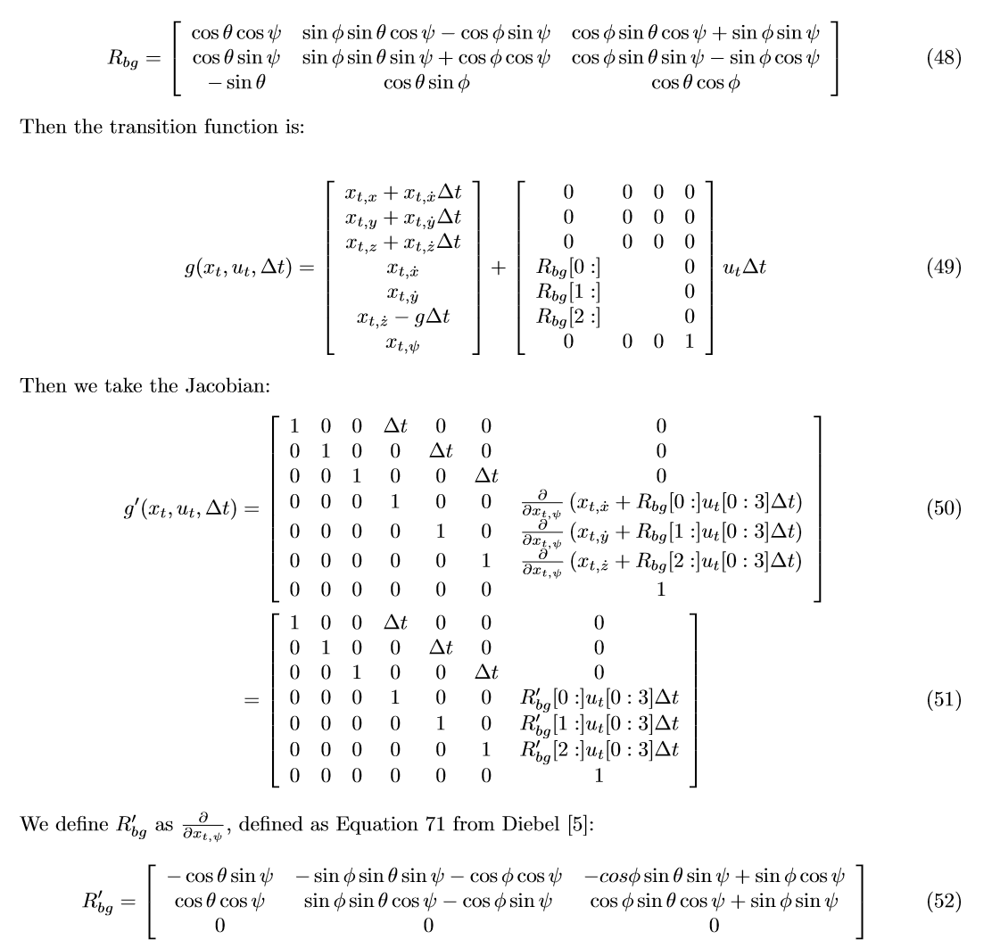
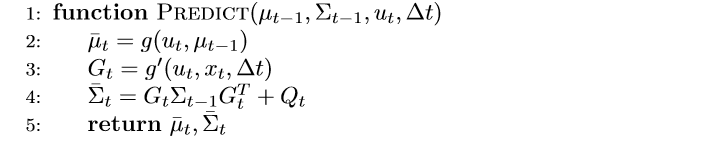
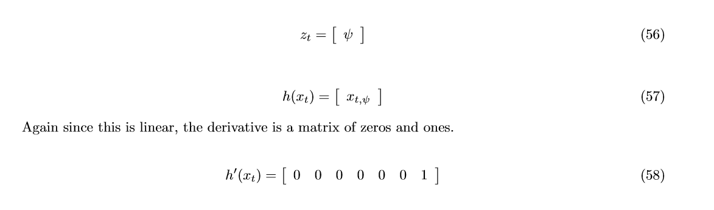
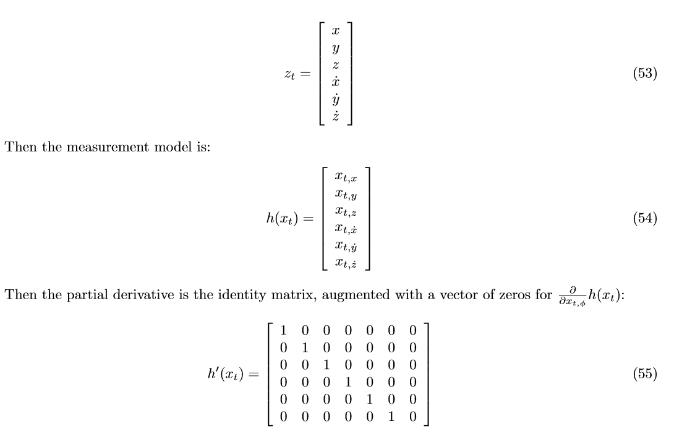
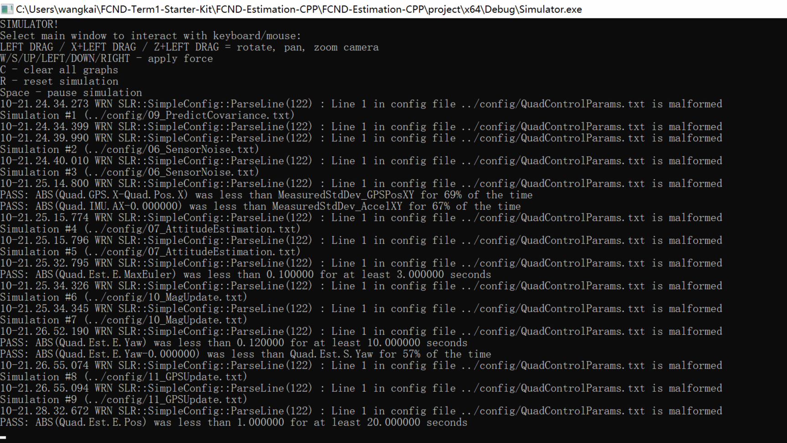

# Writeup Content
1. Determine the standard deviation of the measurement noise of both GPS X data and Accelerometer X data.
2. Implement a better rate gyro attitude integration scheme in the UpdateFromIMU() function.
3. Implement all of the elements of the prediction step for the estimator.
4. Implement the magnetometer update.
5. Implement the GPS update.
6. Flight Evaluation

### Implement Estimator

#### 1. Determine the standard deviation of the measurement noise of both GPS X data and Accelerometer X data.The calculated standard deviation should correctly capture ~68% of the sensor measurements. Your writeup should describe the method used for determining the standard deviation given the simulated sensor measurements.

The measured GPS X data and Accelorometer X data are stored in text files config/log/Graph1.txt and config/log/Graph2.txt.In my_stat.py I use numpy.std() function to get standard deviation.

#### 2. Implement a better rate gyro attitude integration scheme in the UpdateFromIMU() function.The improved integration scheme should result in an attitude estimator of < 0.1 rad for each of the Euler angles for a duration of at least 3 seconds during the simulation. The integration scheme should use quaternions to improve performance over the current simple integration scheme.

In line 92 to 97，I implement a Nonlinear Complementary Filter. I establish a quaternion value by current estimated attitude, then integrate the quaternion by rotation rates from gyro. Finally, fuse the Gyro and Accelerometer in a complementary filter.

#### 3. Implement all of the elements of the prediction step for the estimator.The prediction step should include the state update element (PredictState() function), a correct calculation of the Rgb prime matrix, and a proper update of the state covariance. The acceleration should be accounted for as a command in the calculation of gPrime. The covariance update should follow the classic EKF update equation.

In line 158 to 165 I implement the state(x,y,z,dx,dy,dz) prediction by the first order integral. In line 190 to 195 I implement the RbgPrime which is the the partial derivative of the Rbg rotation matrix.In line 240~246 I implement the gPrime matrix and ekfCov.

#### 4. Implement the magnetometer update.The update should properly include the magnetometer data into the state. Note that the solution should make sure to correctly measure the angle error between the current state and the magnetometer value (error should be the short way around, not the long way).

In line 302~312 I implement the hPrime and zt. I check the difference between the current state and the magnetometer value, if it step out the range [-pi,pi],then change the zt.

#### 5. Implement the GPS update.The estimator should correctly incorporate the GPS information to update the current state estimate.

In line 270 to 281 I implement the hPrime and zt.It's much easier compared to last step.

### Flight Evaluation
#### 1 Meet the performance criteria of each step.For each step of the project, the final estimator should be able to successfully meet the performance criteria with the controller provided. The estimator's parameters should be properly adjusted to satisfy each of the performance criteria elements.
Yes. the estimator have meet the performance criteria with the controller.

#### 2 De-tune your controller to successfully fly the final desired box trajectory with your estimator and realistic sensors.The controller developed in the previous project should be de-tuned to successfully meet the performance criteria of the final scenario (<1m error for entire box flight).

Yes. after tuning kpPosXY from 3 to 2.5, kpVelXY from 12 to 10, kpYaw from 3 to 2.5, KpPQR.z from 20 to 17, the controller successfully meet the performance criteria of the final scenario (<1m error for entire box flight).
